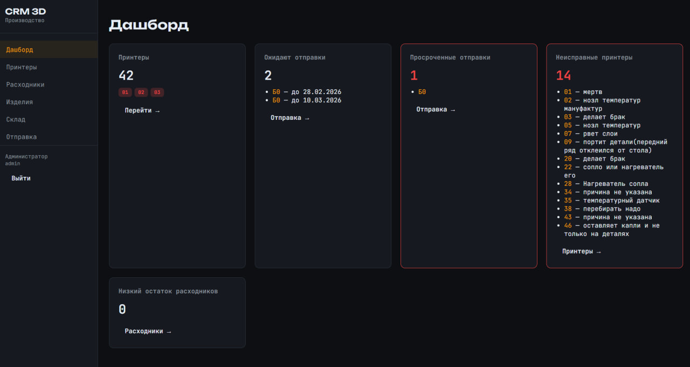
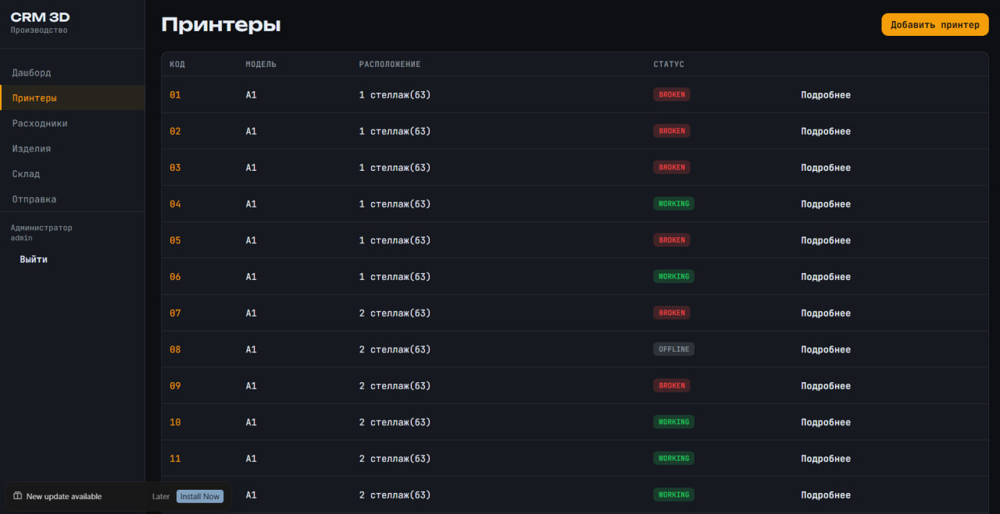
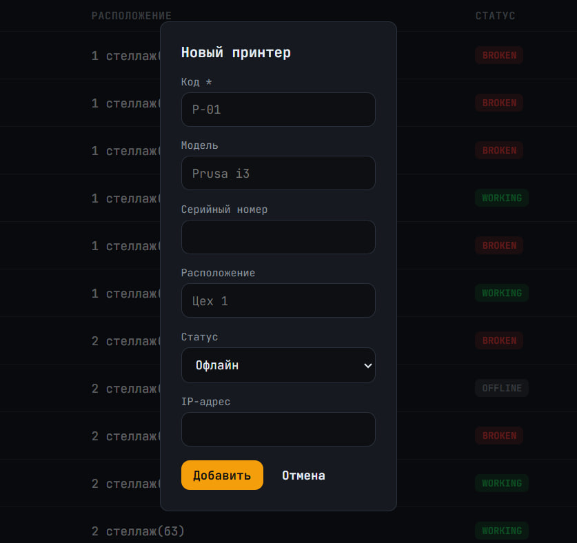
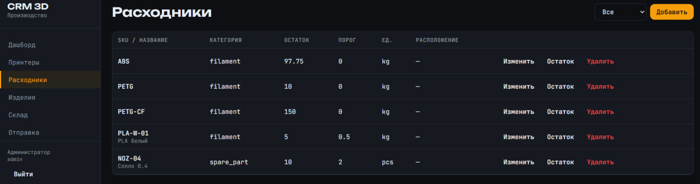
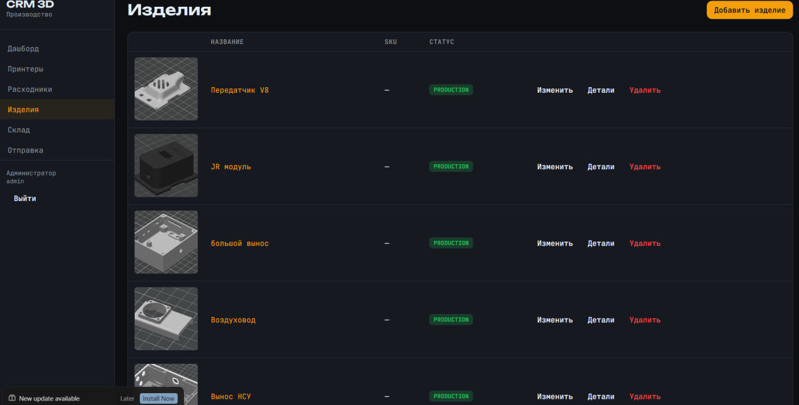
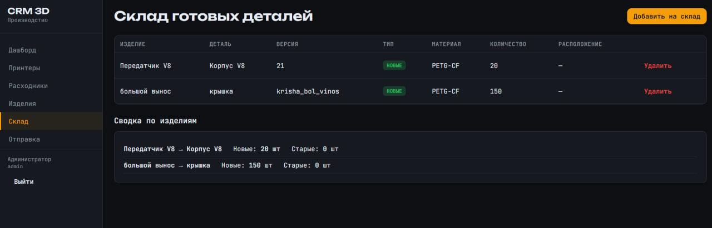
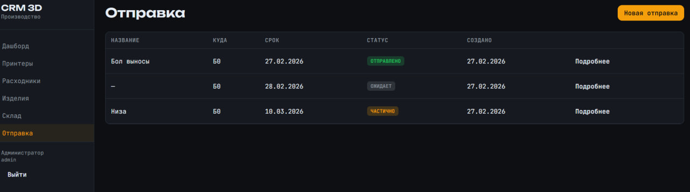

# CRM 3D — производство 

Веб-приложение для учёта 3D-печати: принтеры, расходники, изделия/детали/модели (с превью и скачиванием 3D), склад готовых деталей, отправки (куда и сколько отправить, срок, выполнение).

## Стек

- **Backend:** Node.js, Express, PostgreSQL, JWT
- **Frontend:** React 18, Vite, React Router
- **Запуск:** Docker Compose или локально

## Быстрый старт (локально)

### 1. PostgreSQL

Запустите PostgreSQL (например, локально или в Docker):

```bash
docker run -d --name crm-pg -e POSTGRES_USER=crm -e POSTGRES_PASSWORD=crm -e POSTGRES_DB=crm -p 5432:5432 postgres:15-alpine
```

### 2. Backend

```bash
cd backend
cp .env.example .env
npm install
npm run db:migrate
npm run db:migrate:shipments
npm run db:seed
npm run dev
```

API: http://localhost:3001

### 3. Frontend

```bash
cd frontend
npm install
npm run dev
```

Сайт: http://localhost:5173

### 4. Вход

- **Admin:** admin@crm.local / admin123  
- **Оператор:** operator@crm.local / admin123  

## Запуск через Docker Compose

```bash
docker-compose up -d
```

- Frontend: http://localhost:5173  
- API: http://localhost:3001  
- При первом запуске выполняются миграции и сид (демо-пользователи и данные).

## Основные разделы

| Раздел | Описание |
|--------|----------|
| **Дашборд** | Сводка: принтеры, ожидающие отправки, просроченные, неисправные принтеры, низкий остаток расходников |
| **Принтеры** | Список принтеров, добавление, статус (исправен/не исправен/ТО/офлайн), смена статуса |
| **Расходники** | Пластик, смола, запчасти; остатки и пороги; корректировка количества |
| **Изделия** | Иерархия Product → Part → ModelFile; вес детали; загрузка моделей, скачивание 3D, превью STL; версионность |
| **Склад** | Готовые детали с разбивкой «новые» / «старые»; учёт вносится вручную |
| **Отправка** | Создание отправки (куда, срок, изделия/детали); кнопка «Сделать отправку» — указать количество отправленных |

## API (кратко)

- `POST /api/auth/login` — вход (email, password), возвращает JWT
- `GET/POST /api/printers`, `PATCH /api/printers/:id/status`
- `GET/POST /api/consumables`, `PATCH /api/consumables/:id`
- `GET/POST /api/products`, `GET/POST /api/products/:id/parts`
- `GET /api/parts/:id/models`, `POST /api/parts/:part_id/models`, `PATCH /api/parts/models/:id/status`
- `GET /api/warehouse`, `POST /api/warehouse/adjust`
- `GET/POST /api/shipments`, `PATCH /api/shipments/:id`, `POST /api/shipments/:id/fulfill`

Заголовок авторизации: `Authorization: Bearer <token>`.


## Preview 

### Dashboard

### printers tab



### Consumables(расходники)


### Products (изделия)


### Warehouse (Склад)


### Sending (Отпрака)

